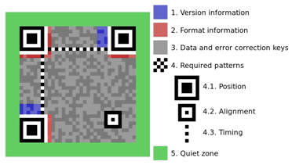
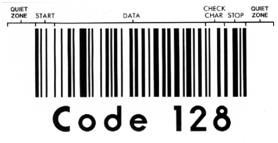

:::danger
Barcode Detection is not available on mobile platforms.
:::

## For which types of barcodes does the SDK automatically check the check digits?

Some barcode standards use check digits as a form of redundancy check for error detection and, where possible, error correction.

Below is a table showing the types of barcode for which the SDK automatically checks the check digits:

:::note
✔ The control is enabled
✘ The control is disabled
:::

Table 1. Control of barcode check digit

| Barcode type | Check digit control |
| --- | --- |
| EAN-13, EAN-8 | ✔ |
| UPC-A | ✔ |
| UPC-E | ✘ |
| MSI, MSI Pharma | ✘ |
| CODABAR | ✘ |
| Interleaved 2 of 5 | ✘ |
| Code 39 (self-checking) | ✘ |
| Code 39 HIBC | ✔ |
| Code 93 | ✔ |
| EAN 128 | ✔ |
| Postnet | ✔ |
| Patchcode | ✔ |
| UCC 128 (GS1 128) | ✔ |
| PDF 417 | ✘ |
| QR Code | ✘ |
| Data Matrix | ✘ |
| Aztec | ✘ |

:::note
Go to Datasheet > Supported barcode types for examples of barcodes.
:::

## How does PDF 417 error correction work?

PDF 417 symbology allows users to include additional data to detect and correct reading errors.

The minimum values recommended by the PDF 417 standard (in paragraph 4.5.3 of the specifications) depend on the amount of data encoded in the barcode (< 2 characters per word, 1.8 for text compression and 2.9 when digital compression is used):

| Number of words for error correction | Minimum level |
| --- | --- |
| 1-40 | 2 |
| 41-160 | 3 |
| 161-320 | 4 |
| 321-863 | 5 |

However, applications that generate 417 PDF barcodes can further increase the security level of two-dimensional barcodes. (The "security level" of two-dimensional barcodes is defined when the barcodes are generated, not when they are read).

This is useful, for example, when barcodes have to be read using a pen scanner. This type of scanner generates images that are much less "stable" than flatbed scanners. Given the lower read quality of pen scanners, PDF 417 barcodes require a higher level of security to be readable by pen scanners (this is particularly true for barcodes that encode small amounts of data).

The table below establishes a link between the level of security and the error detection and correction functions. (Don’t forget that you need two correction words to correct a substitution and one correction word to correct a rejection!)

| Level of correction | Number of words reserved for correction | Number of words reserved for detection | Total |
| --- | --- | --- | --- |
| 0 | 0 | 2 | 2 |
| 1 | 2 | 2 | 4 |
| 2 | 6 | 2 | 8 |
| 3 | 14 | 2 | 16 |
| 4 | 30 | 2 | 32 |
| 5 | 62 | 2 | 64 |
| 6 | 126 | 2 | 128 |
| 7 | 254 | 2 | 256 |
| 8 | 510 | 2 | 512 |

## How to optimize barcode recognition?

### Scanner configuration

For good optical character recognition (OCR) and barcode reading, we recommend scanning in greyscale at 300 dpi or in colour at 300 dpi.

For each barcode, it is important to have a uniform, spacious area around the code to enable it to be read properly, known as the **"quiet zone"**. The dimensions of this "quiet zone" vary from one type of barcode to another.  
As a general rule, a minimum distance of 5 to 6 mm is recommended.

For example, for the QR code, this zone corresponds more precisely to a width of 4 squares.

Image 1. Quiet zone of a QR code

For Code 128, this zone must be at least 6 mm.

Image 2. Quiet zone of a QR code

### Colors

The background colour of the code must be identical to that of the "quiet zone".

## What are the most commonly used barcodes and their ISO references

| Barcode type | Reference |
| --- | --- |
| Code 39 (1D) | [ISO/IEC 16388:2023](https://www.iso.org/standard/77799.html) - Information technology - Automatic identification and data capture technology - Code 39 bar code symbology specification |
| Code 128 (1D) | [ISO/IEC 15417:2007](http://www.iso.org/iso/home/store/catalogue_tc/catalogue_detail.htm?csnumber=43896) - Information technology - Automatic identification and data capture technology - Code 128 bar code symbology specification |
| PDF 417 (2D) | [ISO/IEC 15438:2015](https://www.iso.org/standard/65502.html) - Information technology - Automatic identification and data capture technology - PDF417 bar code symbology specification |
| QR Code (2D) | [ISO/IEC 18004:2024](https://www.iso.org/standard/83389.html) - Information technology - Automatic identification and data capture technology - QR Code 2005 bar code symbology specification |
| DataMatrix (2D) | [ISO/IEC 16022:2024](https://www.iso.org/standard/80926.html) - Information technology - Automatic identification and data capture technology - Data Matrix bar code symbology specification |

## What are the font size limits of the OCR engine?

The font size limits of our OCR engine depend on the resolution of the scanned image. Here are the details:

* **At 300 DPI (dots per inch)**:

  + Maximum character height: 256 pixels
  + Maximum line height: 324 pixels
* **At 600 DPI (dots per inch)**:

  + Although the theoretical maximum character height is 512 pixels, it is actually limited to 400 pixels.
  + Similarly, the theoretical maximum line height is 648 pixels, but it is limited to 512 pixels.
* **Upper limits for all resolutions**:

  + Maximum character height: 400 pixels
  + Maximum line height: 512 pixels

These limits ensure optimal performance and accuracy of our OCR engine across different resolutions.

## What are the page size limits of the OCR engine?

The OCR engine can recognize images containing up to **559 million pixels**. The maximum image size for recognition varies with the image DPI (dots per inch).  
Below is a table showing the maximum resolutions for different paper sizes:

| Paper Standard | Size (inches) | Size (mm) | Maximum Resolution (DPI) | Image at Maximum Resolution (pixels) |
| --- | --- | --- | --- | --- |
| A0 | 33.11 x 46.81 | 841 x 1189 | 600 | 19882 x 28087 |
| A1 | 23.39 x 33.11 | 594 x 841 | 848 | 19888 x 28113 |
| Other formats (A2, A3, A4, A5, A6, Letter, Legal, Junior Legal, Ledger, and Tabloid.) | The principle is the same, but the resolution should not exceed 1200 DPI. | | | |

:::note
A0 format is universally supported, including on 32-bit machines, but memory constraints could be an issue, especially with complex images. Simple black-and-white images are less affected.
:::

**Additional Limitation:**

The width or height of an image must not exceed **32,768 pixels**. This limitation also applies to image preprocessing tasks such as resizing and rotating.

These limits ensure the OCR engine performs optimally across various resolutions and paper sizes.

## Can the SDK treat PDF as input?

Yes, the SDK supports PDF as an input file through the dedicated extension **Extension.ImageFormatsPdfInput**.

However, on platforms where this extension is not available, the SDK does not natively support PDF as an input file. In such cases, we recommend using other SDKs to convert PDFs to image files (such as TIFF or BMP) and then processing these images with our SDK.

Refer to the [Modules per platform](../specifications/modules_per_platform.html) section in **Specifications** for more details.