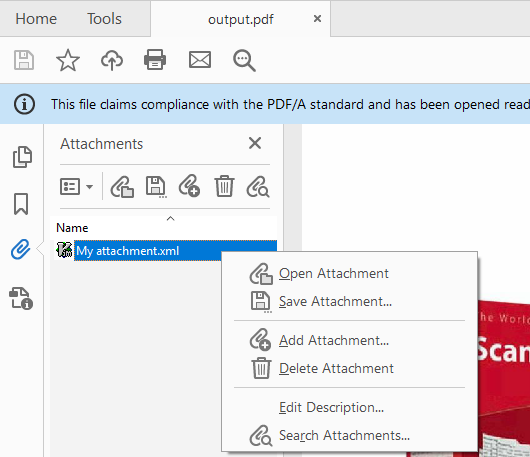

## How to

To set attachments to a PDF, use the **class** `CAttachment` and add them via the **property** `Attachments` of the document’s `CDocumentMetadata` instance.  
The `CDocumentMetadata` instance is accessible via the **property** `DocumentMetadata` of the **class** `CDocument`.

## Creating PDF/A-3 documents

The iDRS can also create PDF/A-3a and/or PDF/A-3b documents.  
PDF/A-3 standard differs from PDF/A-2 only because it allows embedding any type of file inside the PDF.

## Limitations

It is NOT possible to add attachments to PDF/A-1 or PDF/A-2 (not supported)

## Code Snippets

```
//How to create a *PDF/A-3 with an attached XML file*?

// Create an IDRS object
CIDRS objIdrs = CIDRS::Create();

// Load the source image
CImageIO objImageIO = CImageIO::Create(objIdrs);
CPage objPage = objImageIO.LoadPage("path/to/image");

// Create a page recognition object and do recognition
CTextRecognition objTextRecognition = CTextRecognition::Create(objIdrs);
objTextRecognition.RecognizeText(objPage);

// Create a CAttachmentArray and add an attachment to it
CAttachmentArray xAttachments = CAttachmentArray::Create();

CAttachment objAttachment = CAttachment::Create(
	"My attachment.xml name",
	CAttachment::TypeXml,
	"Path to my attachment.xml file");

xAttachments.AddTail(objAttachment);

// Create a document and set the attachments in its metadata
CDocument objDocument = CDocument::Create(objIdrs);
objDocument.GetPages().AddTail(objPage);
objDocument.GetMetadata().SetAttachments(xAttachments);

// Create a DocumentOutput object and save the document
CDocumentWriter objDocumentWriter = CDocumentWriter::Create(objIdrs);
CPdfOutputParams objPdfOutputParams = CPdfOutputParams::Create(PdfVersion::PdfA3a, PageDisplay::ImageOverText);
objDocumentWriter.SetOutputParams(objPdfOutputParams);
objDocumentWriter.Save("Path to the output.pdf", objDocument);
```

```
//How to create a *PDF/A-3 with an attached XML file*?

// Create an IDRS object and a document
using (CIDRS objIdrs = new CIDRS())
using (CDocument objDocument = new CDocument(objIdrs))
using (CImageIO objImageIO = new CImageIO(objIdrs))
using (CPage objPage = objImageIO.LoadPage("myimage"))
{
	// Create a page recognition object and do recognition
	using (CTextRecognition objTextRecognition = new CTextRecognition(objIdrs))
	{
		objTextRecognition.RecognizeText(objPage);
	}

	// Append the page to the document
	objDocument.Pages.AddTail(objPage);

	// Create a CAttachmentArray and add an attachment to it
	using (CIDRSObjArray&lt;CAttachment&gt; xAttachments = new CIDRSObjArray&lt;CAttachment&gt;())
	using (CAttachment objAttachment = new CAttachment(
		"My attachment.xml name",
		AttachmentType.Xml,
		"Path to my attachment.xml file"))
	{
		xAttachments.Add(objAttachment);
	}

	// Add the attachments array to a CDocumentMetadata object
	objDocument.Metadata.Attachments = xAttachments;

	// Create a DocumentOutput object and save the document
	using (CDocumentWriter objDocumentWriter = new CDocumentWriter(objIdrs))
	using (CPdfOutputParams objPdfOutputParams = new CPdfOutputParams(PdfVersion.PdfA3a, PageDisplay.ImageOverText))
	{
		objDocumentWriter.OutputParams = objPdfOutputParams;
		objDocumentWriter.Save("Path to the output.pdf", objDocument);
	}
}
```



Image 1. “Attachments” tab of the created PDF document

:::note
For detailed information on PDF output compatibilities, go to PDF Options availability.
:::