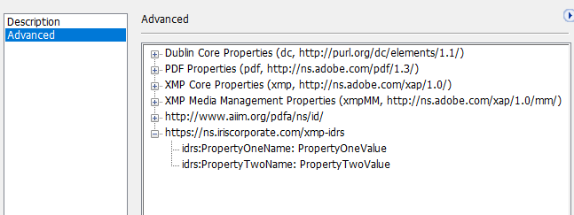
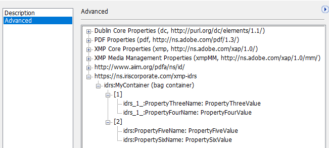

## Classes

A set of **classes** allow you to integrate any kind of metadata into created PDFs.

* `CPdfCustomMetadata`, representing the root container of metadata
* `CPdfCustomMetadataContainer`
* `CPdfCustomMetadataProperty`
* `CPdfCustomMetadataPropertyList`
* `CPdfCustomMetadataResource`

## Code Snippets

The simplest way to create custom metadata is to create a list of properties and attach it to the main container.

### 1. Creating a simple list of name:value properties

```
// Create an IDRS object
CIDRS objIdrs = CIDRS::Create();

// Load the source image
CImageIO objImageIO = CImageIO::Create(objIdrs);
CPage objPage = objImageIO.LoadPage("path/to/image");

// Setup and launch OCR
CTextRecognition objTextRecognition = CTextRecognition::Create(objIdrs);
objTextRecognition.RecognizeText(objPage);

// Create the properties
CPdfCustomMetadataProperty objPropertyOne = CPdfCustomMetadataProperty::Create(
	"PropertyOneName",
	"PropertyOneValue");
CPdfCustomMetadataProperty objPropertyTwo = CPdfCustomMetadataProperty::Create(
	"PropertyTwoName",
	"PropertyTwoValue");
CPdfCustomMetadataProperty objPropertyThree = CPdfCustomMetadataProperty::Create(
	"PropertyThreeName",
	"PropertyThreeValue");
CPdfCustomMetadataProperty objPropertyFour = CPdfCustomMetadataProperty::Create(
	"PropertyFourName",
	"PropertyFourValue");

// Create property list with custom namespace
CPdfCustomMetadataPropertyList objCustomMetadataPropertyListWithNS = CPdfCustomMetadataPropertyList::Create();
objCustomMetadataPropertyListWithNS.AddProperty(objPropertyOne);
objCustomMetadataPropertyListWithNS.AddProperty(objPropertyTwo);

CPdfCustomMetadataPropertyList objCustomMetadataPropertyListWithNS2 = CPdfCustomMetadataPropertyList::Create();
objCustomMetadataPropertyListWithNS2.AddProperty(objPropertyThree);
objCustomMetadataPropertyListWithNS2.AddProperty(objPropertyFour);

// Create metadata object and add the list property
CPdfCustomMetadata objPdfCustomMetadata = CPdfCustomMetadata::Create();
objPdfCustomMetadata.Add(objCustomMetadataPropertyListWithNS);
objPdfCustomMetadata.Add(objCustomMetadataPropertyListWithNS2);

// Create pdf output parameter object and set the custom metadata
CPdfOutputParams objPdfOutputParams = CPdfOutputParams::Create(
	PdfVersion::Pdf17,
	PageDisplay::TextAndGraphics);

objPdfOutputParams.SetPdfCustomMetadata(objPdfCustomMetadata);

// Create a DocumentWriter object and save the document
CDocumentWriter objDocumentWriter = CDocumentWriter::Create(objIdrs);
objDocumentWriter.SetOutputParams(objPdfOutputParams);
objDocumentWriter.Save("Path to the output.pdf", &objPage, 1);
```

```
// Create an IDRS object
using (CIDRS objIdrs = new CIDRS())
{
	// Create a page object and load the source image
	using (CImageIO objImageIO = new CImageIO(objIdrs))
	using (CPage objPage = objImageIO.LoadPage("myimage"))
	{
		// Setup and launch OCR
		using (CTextRecognition objTextRecognition = new CTextRecognition(objIdrs))
		{
			objTextRecognition.RecognizeText(objPage);

			// Create the properties
			CPdfCustomMetadataProperty objPropertyOne = new CPdfCustomMetadataProperty(
			"PropertyOneName",
			"PropertyOneValue");
			CPdfCustomMetadataProperty objPropertyTwo = new CPdfCustomMetadataProperty(
			"PropertyTwoName",
			"PropertyTwoValue");
			CPdfCustomMetadataProperty objPropertyThree = new CPdfCustomMetadataProperty(
			"PropertyThreeName",
			"PropertyThreeValue");
			CPdfCustomMetadataProperty objPropertyFour = new CPdfCustomMetadataProperty(
			"PropertyFourName",
			"PropertyFourValue");

			// Create property list with custom namespace
			CPdfCustomMetadataPropertyList objCustomMetadataPropertyListWithNS = new CPdfCustomMetadataPropertyList();
			objCustomMetadataPropertyListWithNS.AddProperty(objPropertyOne);
			objCustomMetadataPropertyListWithNS.AddProperty(objPropertyTwo);

			CPdfCustomMetadataPropertyList objCustomMetadataPropertyListWithNS2 = new CPdfCustomMetadataPropertyList();
			objCustomMetadataPropertyListWithNS2.AddProperty(objPropertyThree);
			objCustomMetadataPropertyListWithNS2.AddProperty(objPropertyFour);

			// Create metadata object and add the list property
			using (CPdfCustomMetadata objPdfCustomMetadata = new CPdfCustomMetadata())
			{
				objPdfCustomMetadata.Add(objCustomMetadataPropertyListWithNS);
				objPdfCustomMetadata.Add(objCustomMetadataPropertyListWithNS2);

				// Create pdf output parameter object and set the custom metadata
				using (CPdfOutputParams objPdfOutputParams = new CPdfOutputParams(
					PdfVersion.Pdf17,
					PageDisplay.TextAndGraphics))
				{
					// Create a DocumentWriter object and save the document
					using (CDocumentWriter objDocumentWriter = new CDocumentWriter(objIdrs))
					{
						objDocumentWriter.OutputParams = objPdfOutputParams;
						objPdfOutputParams.PdfCustomMetadata = objPdfCustomMetadata;
						objDocumentWriter.Save("Path to the output.pdf", new List&lt;CPage&gt;() { objPage }.ToArray());
					}
				}
			}
		}
	}
}
```

Will produce this output



### 2. Creating bag containers (Bag containers can gather lists of properties)

```
// Create an IDRS object
CIDRS objIdrs = CIDRS::Create ();
// Create a page object and load the source image
CImage objImage = CImage::Create(objIdrs, idrs_t("Path to image to load"))
CPage objPage = CPage::Create (objImage);

// Launch OCR
CTextRecognition objTextRecognition = CTextRecognition::Create (objIdrs);
objTextRecognition.RecognizeText (objPage);

// Create the properties
CPdfCustomMetadataProperty objPropertyOne = CPdfCustomMetadataProperty::Create (
	"PropertyOneName",
	"PropertyOneValue");
CPdfCustomMetadataProperty objPropertyTwo = CPdfCustomMetadataProperty::Create (
	"PropertyTwoName",
	"PropertyTwoValue");
CPdfCustomMetadataProperty objPropertyThree = CPdfCustomMetadataProperty::Create (
	"PropertyThreeName",
	"PropertyThreeValue");
CPdfCustomMetadataProperty objPropertyFour = CPdfCustomMetadataProperty::Create (
	"PropertyFourName",
	"PropertyFourValue");

// Create property list with custom namespace
CPdfCustomMetadataPropertyList objCustomMetadataPropertyListWithNS = CPdfCustomMetadataPropertyList::Create ();
objCustomMetadataPropertyListWithNS.AddProperty (objPropertyOne);
objCustomMetadataPropertyListWithNS.AddProperty (objPropertyTwo);

CPdfCustomMetadataPropertyList objCustomMetadataPropertyListWithNS2 = CPdfCustomMetadataPropertyList::Create ();
objCustomMetadataPropertyListWithNS2.AddProperty (objPropertyThree);
objCustomMetadataPropertyListWithNS2.AddProperty (objPropertyFour);

// Create a bag container, append the property lists to it.
CPdfCustomMetadataContainer objPdfCustomMetadataContainer = CPdfCustomMetadataContainer::Create ("MyContainer");
objPdfCustomMetadataContainer.Add (objCustomMetadataPropertyListWithNS);
objPdfCustomMetadataContainer.Add (objCustomMetadataPropertyListWithNS2);

// Create metadata object and add the list property
CPdfCustomMetadata objPdfCustomMetadata = CPdfCustomMetadata::Create ();
objPdfCustomMetadata.Add (objPdfCustomMetadataContainer);

// Create pdf output parameter object and set the custom metadata
CPdfOutputParams objPdfOutputParams = CPdfOutputParams::Create (
	PdfVersion::Pdf17,
	PageDisplay::TextAndGraphics);

// Create a DocumentOutput object and save the document
CDocumentWriter objDocumentWriter = CDocumentWriter::Create (objIdrs);
objDocumentWriter.SetOutputParams(objPdfOutputParams);

objPdfOutputParams.SetPdfCustomMetadata (objPdfCustomMetadata);
objDocumentWriter.Save ( idrs_t ("Path to the output.pdf"), &objPage,1);
```

```
// Create an IDRS object
using (CIDRS objIdrs = new CIDRS())
{
  // Create a page object and load the source image
  using (CImageIO objImageIO = new CImageIO(objIdrs))
  using (CPage objPage = objImageIO.LoadPage("myimage"))
  {
    // Setup and launch OCR
    using (CTextRecognition objTextRecognition = new CTextRecognition(objIdrs))
    {
      objTextRecognition.RecognizeText(objPage);

      // Create the properties
      CPdfCustomMetadataProperty objPropertyOne = new CPdfCustomMetadataProperty(
      "PropertyOneName",
      "PropertyOneValue");
      CPdfCustomMetadataProperty objPropertyTwo = new CPdfCustomMetadataProperty(
      "PropertyTwoName",
      "PropertyTwoValue");
      CPdfCustomMetadataProperty objPropertyThree = new CPdfCustomMetadataProperty(
      "PropertyThreeName",
      "PropertyThreeValue");
      CPdfCustomMetadataProperty objPropertyFour = new CPdfCustomMetadataProperty(
      "PropertyFourName",
      "PropertyFourValue");

      // Create property list with custom namespace
      CPdfCustomMetadataPropertyList objCustomMetadataPropertyListWithNS = new CPdfCustomMetadataPropertyList();
      objCustomMetadataPropertyListWithNS.AddProperty(objPropertyOne);
      objCustomMetadataPropertyListWithNS.AddProperty(objPropertyTwo);

      CPdfCustomMetadataPropertyList objCustomMetadataPropertyListWithNS2 = new CPdfCustomMetadataPropertyList();
      objCustomMetadataPropertyListWithNS2.AddProperty(objPropertyThree);
      objCustomMetadataPropertyListWithNS2.AddProperty(objPropertyFour);

      // Create metadata object and add the list property
      using (CPdfCustomMetadata objPdfCustomMetadata = new CPdfCustomMetadata())
      {
        objPdfCustomMetadata.Add(objCustomMetadataPropertyListWithNS);
        objPdfCustomMetadata.Add(objCustomMetadataPropertyListWithNS2);

        // Create pdf output parameter object and set the custom metadata
        using (CPdfOutputParams objPdfOutputParams = new CPdfOutputParams(
          PdfVersion.Pdf17,
          PageDisplay.TextAndGraphics))
        {
          // Create a DocumentWriter object and save the document
          using (CDocumentWriter objDocumentWriter = new CDocumentWriter(objIdrs))
          {
            objDocumentWriter.OutputParams = objPdfOutputParams;
            objPdfOutputParams.PdfCustomMetadata = objPdfCustomMetadata;
            objDocumentWriter.Save("Path to the output.pdf", new List&lt;CPage&gt;() { objPage }.ToArray());
          }
        }
      }
    }
  }
}
```

Will produce this output

