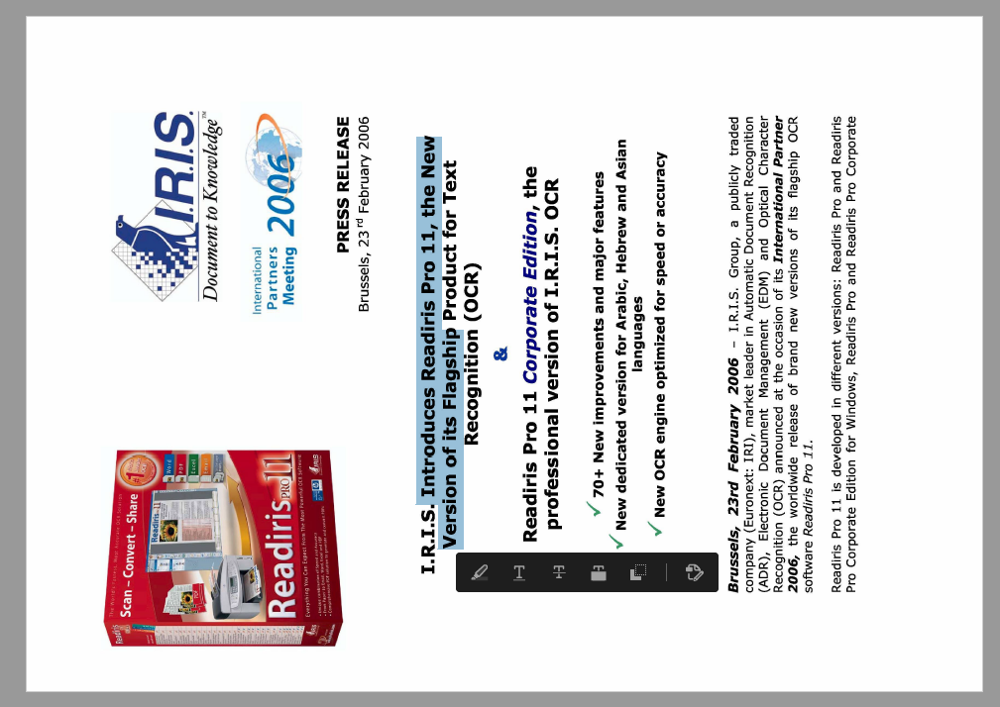

The IRISOCR™ SDK has the notion of *original rotation angle* in **CPageContent2** data representation, accessible via **methods** `Get/SetOriginalRotation()` (C++) or **property** `OriginalRotation` (.NET).

That member is updated when performing automatic orientation detection via **CPageRecognition methods** `AnalyzeLayout()`, `AnalyzeLayoutEx()`, `RecognizePage()`, or `RecognizePageEx()`. You can also modify it directly.

A **flag** is available in **CPdfOutputParameters** via **methods** `Get/SetUseOriginalRotation` (C++) or **property** `UseOriginalRotation` (.NET), with *false* as default value.  
When this flag is set, the pages of the created PDF are rotated according to the original page orientation as mentioned in the page content.

For instance, the PDF generated from an image scanned with 90° rotation would appear in PDF viewers in the same orientation than the image, even if OCR was performed on the correctly-oriented equivalent:

Image 1. 90° original rotation

The original rotation value is not used by other output formats at the moment.