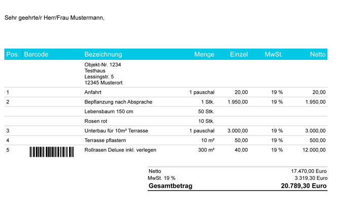

:::danger
The Data Extraction is available only on Windows. See the Changelog 16.3.0 for details.
:::

The **data extraction** feature enables you to perform **fuzzy search** across various data types:

* Numbers/Amounts
* Dates
* Regular expressions
* Plain text

The article below explains how to get started with this feature.

:::note
The SDK package includes a sample application that shows how to use the data extraction feature.
:::

## Setup

Data extraction is a module-locked feature. To use it, you need a valid license key. To activate data extraction, create a `CIDRSLicense` object and call `CIDRSSetup::SetupModule()` to load the module.

## Data extraction flow

The data extraction API takes as input a `CPageContent` object that contains OCR results. The image is not needed to start the process. After processing, the API returns the results as a `CSearchResultArray`.

:::note
Searches are performed across the entire page. It is not yet possible to restrict the search to a specific area of the page.
:::

### Basic search

You can perform basic searches by creating one of the following context classes:

* `CNumberSearchContext`: searches for numbers. The class provides also some parameters to configure the search.
* `CTextSearchContext`: searches for keywords in the text.
* `CRegexSearchContext`: searches for all text that matches a given regular expression.
* `CDateSearchContext`: searches for all dates in the document.

A search can include one or more `CSearchContext` objects.

The example below shows how to set up, run, and parse a data search.

```
  // Initialization
  CIDRS objIdrs = CIDRS::Create();
  CImageIO objImageIO = CImageIO::Create(objIdrs);
  CImage objImage = objImageIO.Load&lt;CImage&gt;(strImageFile);

  // Preprocessing + Recognize text to get OCR results filled
  CTextRecognition objTextRecognition = CTextRecognition::Create(objIdrs);
  CPageContent objPageContent = objTextRecognition.RecognizeText(objImage);

  // Create search contexts
  // In this example we will search for:
  // - Emails in the document
  // - All text matching "IRIS" keyword
  CRegexSearchContext objEmailSearchContext = CRegexSearchContext::Create("([A-Za-z0-9.-]+)@([A-Za-z0-9]+)\\.([A-Za-z0-9]+)");
  CTextSearchContext objTextSearchContext = CTextSearchContext::Create("IRIS");

  CSearchContextArray xobjSearchContexts = CSearchContextArray::Create();
  xobjSearchContexts.AddTail(objEmailSearchContext);
  xobjSearchContexts.AddTail(objTextSearchContext);

  // Launch data extraction
  CSearchResultArray xobjSearchResults = CDataExtraction::ExtractData(objPageContent, xobjSearchContexts);

  // Parsing the results
  // A CSearchResult is linked to a CSearchContext. If you w
  for (const CSearchResult& objResult : xobjSearchResults)
  {
    for (const CSearchMatch& objMatch : objResult.GetMatches())
    {
      std::cout << "Found match for context '" << objResult.GetIdentifier().c_str() << "': '" << objMatch.GetFormattedText().c_str() << "'" << std::endl;
      std::cout << "Zone: x1= " << objMatch.GetBoundingBox().iLeft << " x2= " << objMatch.GetBoundingBox().iRight
        << " y1= " << objMatch.GetBoundingBox().iTop << " y2= " << objMatch.GetBoundingBox().iBottom << std::endl;
    }
  }
```

```
// Initialization
using (CIDRS objIdrs = new CIDRS())
using (CImageIO objImageIO = new CImageIO(objIdrs))
using (CImage objImage = objImageIO.Load&lt;CImage&gt;(strImageFile))
using (CTextRecognition objTextRecognition = new CTextRecognition(objIdrs))
{
  // Recognize text to get OCR results filled
  var objPageContent = objTextRecognition.RecognizeText(objImage);

  // Create search contexts
  // In this example we will search for:
  // - Emails in the document
  // - All text matching "IRIS" keyword
  var objEmailSearchContext = new CRegexSearchContext("([A-Za-z0-9.-]+)@([A-Za-z0-9]+)\\.([A-Za-z0-9]+)");
  var objTextSearchContext = new CTextSearchContext("IRIS");

  var xobjSearchContexts = new CIDRSObjArray&lt;CSearchContext&gt;();
  xobjSearchContexts.Add(objEmailSearchContext);
  xobjSearchContexts.Add(objTextSearchContext);

  // Launch data extraction
  var xobjSearchResults = CDataExtraction.ExtractData(objPageContent, xobjSearchContexts);

  // Parsing the results
  // A CSearchResult is linked to a CSearchContext. If you w
  foreach (var objResult in xobjSearchResults)
  {
    foreach (var objMatch in objResult.Matches)
    {
      Console.WriteLine("Found match for context {objResult.Identifier} : '{objMatch.FormattedText}'");

      Console.WriteLine("Zone: x1= {objMatch.BoundingBox.iLeft} x2= {objMatch.BoundingBox.iRight} y1= {objMatch.BoundingBox.iTop} y2= {objMatch.BoundingBox.iBottom}");
    }
  }
}
```

### Advanced search: Chained search

The data extraction feature supports chained searches. In a chained search, the result of one search depends on the result of its parent search. Each basic search context includes a method called `FollowedBy()`. This method takes two parameters:

* a CSearchContext object
* a direction to look for (e.g., Left, Right, Up, DownLeft)

Example:

Consider the following image:



```
// Searching the Net Amount line
// Will create a chain looking for "Netto" followed by a number, followed by a currency (= regex search)
const auto objNetAmount = CTextSearchContext::Create("Netto")
                                             .FollowedBy( MatchPosition::Right, CNumberSearchContext::Create() )
                                             .FollowedBy( MatchPosition::Right, CRegexSearchContext::Create("[a-zA-Z$€]+") );

// Adding the VAT number.
// This is equal to the search for net amount
 auto objCurrency = CRegexSearchContext::Create("[a-zA-Z$€]+");
 objCurrency.SetIdentifier("Currency");
 auto objAmountWithCurrency  = CNumberSearchContext::Create().FollowedBy( MatchPosition::Right, objCurrency );
 objAmountWithCurrency.SetIdentifier("Amount");
 auto objVATAmount = CTextSearchContext::Create("MwSt. 19 %").FollowedBy( MatchPosition::Right, objAmountWithCurrency );
 objVATAmount.SetIdentifier("VATAmountKeyword");

 CSearchContextArray objSearchContexts = CSearchContextArray::Create();
 objSearchContexts.AddTail(objNetAmount);
 objSearchContexts.AddTail(objVATAmount);
```