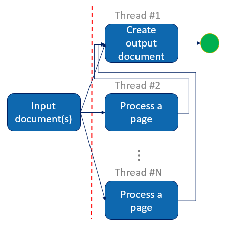

## Conversion of multipage documents

If you want to take advantage of **multithreading**, you can use the interface `IPageQueue` or its implementation `CRangedPageQueue` to start the multipage document conversion right at the beginning of the OCR processing.



Image 1. Document conversion workflow using `CRangedPageQueue`

So you can use the processed pages as soon as the output document engine has retrieved them.

## Code snippets

:::note
The code snippet does not show exception handling to keep it simple.
:::

Usign `CRangedPageQueue` in a multithreaded document conversion workflow with C++ API and OpenMP instructions

```
// Create the ranged page queue with an appropriate size, according to available
// memory and number of OCR threads.
CRangedPageQueue objRangedPageQueue = CRangedPageQueue::Create ( 9 );
omp_set_nested ( 1 );
#pragma omp parallel sections num_threads(2)
{
  // First thread will start document output
  #pragma omp section
  {
    CDocumentOutput objDocumentOutput = CDocumentOutput::Create ( CIDRS::Create ());
    objDocumentOutput.Save ( strOutputPath, objOutputParameters, objRangedPageQueue );
  }
  #pragma omp section
  {
    // The 3 other threads will be performing OCR
    const int iProcessingThreadCount = 3;
    #pragma omp parallel num_threads(iProcessingThreadCount)
    for ( ... )
    {
      // Retrieve the number of the next page to process
      IDRS_INT iPageToProcess = ( ... );

      // Load and process it
      CPage objPage = CPage::Create ( ... );

      // ...

      // Once process is done, wait until the queue is able to store this page
      // before starting processing of a new one
      while ( ! objRangedPageQueue.TryAddPage ( objPage, iPageToProcess ))
      {
        Sleep ( 50 );
      }
    }
    // When the end of the document is reached, close the page queue
    // to complete document creation.
    objRangedPageQueue.Close ();
  }
}
```

Using `CRangedPageQueue` in a multithreaded document conversion workflow with .NET API

```
// Create the ranged page queue with an appropriate size, according to available
// memory and number of OCR threads.
CRangedPageQueue objRangedPageQueue = new CRangedPageQueue(9);

// Start document output in a separate thread
Thread objOutputThread = new Thread(() =>
{
  CDocumentOutput objDocumentOutput = new CDocumentOutput(new CIDRS());
  objDocumentOutput.Save(strOutputPath, objOutputParameters, objRangedPageQueue);
});
objOutputThread.Start();

// Then start OCR in 3 other threads
const int iProcessingThreadCount = 3;
Parallel.For(...,
  new ParallelOptions { MaxDegreeOfParallelism = iProcessingThreadCount },
  ... =>
{

  // Retrieve the number of the next page to process
  UInt32 uiPageToProcess = (...);

  // Load and process it
  using (CPage objPage = new CPage(...))
  {
    // ...

    // Once process is done, wait until the queue is able to store this page,
    // before starting processing of a new one
    while (!objRangedPageQueue.TryAddPage(objPage, uiPageToProcess))
    {
      Thread.Sleep(50);
    }
  }
});

// When the end of the document is reached, close the page queue
// to complete document creation.
objRangedPageQueue.Close();

// Wait for the document output thread completion before exiting
objOutputThread.Join();
```