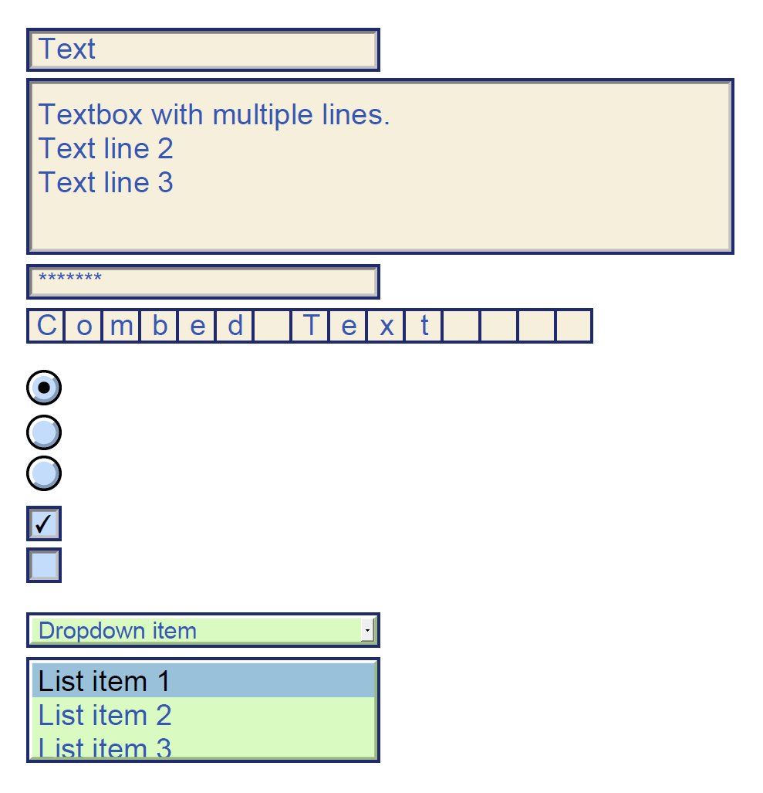
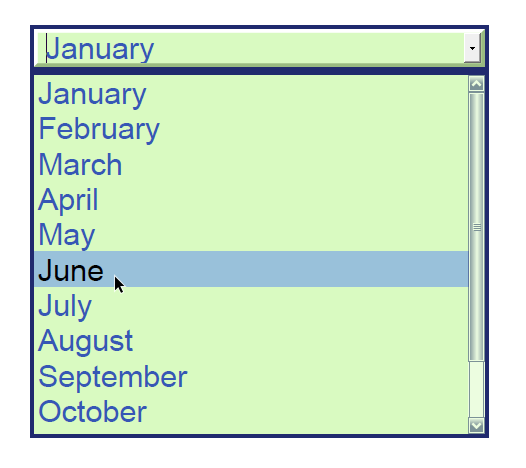
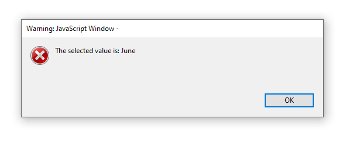

The iDRS has the notion of ***form field***, and allows several operations around it:

1. You can **add and edit** form fields in a `CPageContent` object
2. During OCR processing, you can **detect empty form fields**, and automatically add candidates found in the `CPageContent` object
3. Form fields can be added to the **output PDF documents**

## Form field types

The following **form field types** are supported:

| Field type | Detection1 | Edition | PDF output |
| --- | --- | --- | --- |
| Text | ✔ | ✔ | Text field (+ multiline flag if multiline) |
| Combed text | ✔ | ✔ | Text field - Comb |
| Password text | ✘ | ✔ | Text field - Password |
| Check box | ✔ | ✔ | Button field - Check box |
| Radio button | ✘ | ✔ | Button field - Radio button |
| Dropdown | ✘ | ✔ | Choice field - Combo box (+ editable flag if editable) |
| List box | ✘ | ✔ | Choice field - Scrollable list box |

1 The **detection** feature can only find **empty** form fields, i.e. those that do not contain any written data. Form fields containing an existing value will NOT be detected.



Image 1. Field types

## Detecting

The **new property `COcrPageParams.DetectEmptyFormFields`** allows to activate the detection of form fields during character recognition.

The detection results are available in the `CPageInteractiveForm` instance of the `CPage` content.

## Editing

**The class `CPageInteractiveForm`** handles form fields.  
It allows you to set or update the default form style via the `CPageInteractiveForm.DefaultFieldStyle` property, and the form fields themselves via the `CPageInteractiveForm.FormFields` property.

This class is accessible using the **property `CPageMetadata.InteractiveForm`**.

## Output

If the `CPage` objects in the document to be created contain form fields AND **the output type is PDF**, then they will be added to the output.

Other formats do not yet support this feature; this possibility may be added in a future release, depending on business needs.

## Code Snippets

### Forms detection

```
/* Load the source image into the CPage object */
CIDRS objIdrs = CIDRS::Create();
CImageIO objImageIO = CImageIO::Create(objIdrs);
CPage objPage = objImageIO.LoadPage("path/to/image");

/* Setup the OCR context and enable the forms detection */
COcrContext objOcrContext = COcrContext::Create(Language::English);

/* Setup the page recognition */
COcrPageParams objOcrPageParams = COcrPageParams::Create(objOcrContext);
objOcrPageParams.SetDetectEmptyFormFields(IDRS_TRUE);
CTextRecognition objTextRecognition = CTextRecognition::Create(objIdrs, objOcrPageParams);

/* Execute the page recognition */
objTextRecognition.RecognizeText(objPage);

/* Check whether form fields have been detected */
CPageInteractiveForm objInteractiveForm = objPage.GetPageContent().GetMetadata().GetInteractiveForm();
CFormFieldArray xobjFormFields = objInteractiveForm.GetFormFields();

if (xobjFormFields.GetCount() > 0)
{
  /* loop through the detected fields */
  for (IDRS_UINT uiIndex = 0; uiIndex < xobjFormFields.GetCount(); uiIndex++)
  {
    CFormField objFormField = xobjFormFields.GetAt(uiIndex);

    /* Specific processing based on detected field type */
    if (objFormField.GetFormFieldType() == FormFieldType::Text)
    {
      CFormTextField objTextField = objFormField;
      IDRS_RECT rcBoundingBox = objTextField.GetBoundingBox();

      printf("Text field detected with bounding box (%d,%d,%d,%d)\n",
        rcBoundingBox.iLeft, rcBoundingBox.iTop, rcBoundingBox.iRight, rcBoundingBox.iBottom);
    }
  }
}
else
{
  printf("No form field detected on the page\n");
}
```

```
/* Load the source image into the CPage object */
CIDRS objIdrs = new CIDRS();

CImageIO objImageIO = new CImageIO(objIdrs);
CPage objPage = objImageIO.LoadPage("myimage");

/* Setup the OCR context and enable the forms detection */
COcrContext objOcrContext = new COcrContext(Language.English);

/* Setup the page recognition */
COcrPageParams objOcrPageParams = new COcrPageParams(objOcrContext);
objOcrPageParams.DetectEmptyFormFields = true;
CTextRecognition objTextRecognition = new CTextRecognition(objIdrs, objOcrPageParams);

/* Execute the page recognition */
objTextRecognition.RecognizeText(objPage);

/* Check whether form fields have been detected */
CPageInteractiveForm objInteractiveForm = objPage.PageContent.Metadata.InteractiveForm;
CIDRSObjArray&lt;CFormField&gt; xFieldsArray = objInteractiveForm.FormFields;

if (xFieldsArray.Count > 0)
{
  /* loop through the detected fields */
  for (int iIndex = 0; iIndex < xFieldsArray.Count; iIndex++)
  {
    CFormField objFormField = xFieldsArray[iIndex];

    /* Specific processing based on detected field type */
    if (objFormField.FormFieldType == FormFieldType.Text)
    {
      CFormTextField objTextField = (CFormTextField)objFormField;
      CIDRSRect rcBoundingBox = objTextField.BoundingBox;

      Console.Out.WriteLine("Text field detected with bounding box (" +
      rcBoundingBox.Left + "," + rcBoundingBox.Top + "," + rcBoundingBox.Right + "," + rcBoundingBox.Bottom + ")");
    }
  }
}
else
{
  Console.Out.WriteLine("No form field detected on the page\n");
}
```

### Forms detection, update default style, and create the output

```
/* Load the source image into the CPage object */
CIDRS objIdrs = CIDRS::Create();
CImageIO objImageIO = CImageIO::Create(objIdrs);
CPage objPage = objImageIO.LoadPage("path/to/image");

/* Setup the OCR context and enable the forms detection */
COcrContext objOcrContext = COcrContext::Create(Language::English);

/* Setup the page recognition */
COcrPageParams objOcrPageParams = COcrPageParams::Create(objOcrContext);
objOcrPageParams.SetDetectEmptyFormFields(IDRS_TRUE);
CTextRecognition objTextRecognition = CTextRecognition::Create(objIdrs, objOcrPageParams);

/* Execute the page recognition */
objTextRecognition.RecognizeText(objPage);

/* Create a default style to be applied to the form */
CFormFieldStyle objDefaultStyle = CFormFieldStyle::Create();
IDRS_COLOR stBackGroundColor = { 255, 243, 197 };
objDefaultStyle.SetBackgroundColor(stBackGroundColor);
objDefaultStyle.SetBorderStyle(FormFieldBorderStyle::Inset);
objDefaultStyle.SetBorderWidth(1);

/* Get the interactive form and redefine the default style */
CPageInteractiveForm objIntercativeForm = objPage.GetPageContent().GetMetadata().GetInteractiveForm();
objIntercativeForm.SetDefaultFieldStyle(objDefaultStyle);

/* Create the output */
CDocumentWriter objDocumentWriter = CDocumentWriter::Create(objIdrs);
CPdfOutputParams objPdfOutputParams = CPdfOutputParams::Create(PdfVersion::Pdf17, PageDisplay::TextAndGraphics);
objDocumentWriter.SetOutputParams(objPdfOutputParams);
objDocumentWriter.Save("path/to/output", &objPage, 1);
```

```
/* Load the source image into the CPage object */
CIDRS objIdrs = new CIDRS();
CImageIO objImageIO = new CImageIO(objIdrs);
CPage objPage = objImageIO.LoadPage("myimage");

/* Setup the OCR context and enable the forms detection */
COcrContext objOcrContext = new COcrContext(Language.English);

/* Setup the page recognition */
COcrPageParams objOcrPageParams = new COcrPageParams()
{
  Context = objOcrContext,
  DetectEmptyFormFields = true
};
CTextRecognition objTextRecognition = new CTextRecognition(objIdrs, objOcrPageParams);

/* Execute the page recognition */
objTextRecognition.RecognizeText(objPage);

/* Create a default style to be applied to the form */
CFormFieldStyle objDefaultStyle = new CFormFieldStyle();
CIDRSColor stBackgroundColor = new CIDRSColor(255, 243, 197);
objDefaultStyle.BackgroundColor = stBackgroundColor;
objDefaultStyle.BorderStyle = FormFieldBorderStyle.Inset;
objDefaultStyle.BorderWidth = 1;

/* Generate the interactive form and redefine the default style */
CPageInteractiveForm objInteractiveForm = objPage.PageContent.Metadata.InteractiveForm;
objInteractiveForm.DefaultFieldStyle = objDefaultStyle;

/* Create the output */
CDocumentWriter objDocumentWriter = new CDocumentWriter(objIdrs);
CPdfOutputParams objPdfOutputParams = new CPdfOutputParams(PdfVersion.Pdf17, PageDisplay.TextAndGraphics);
objDocumentWriter.OutputParams = objPdfOutputParams;
objDocumentWriter.Save("Output.pdf", new List&lt;CPage&gt;() { objPage }.ToArray());
```


Image 2. Binarized output styled

### Create and add a Form field

```
/* Create and set the default style for the fields */
CFormFieldStyle objDefaultStyle = CFormFieldStyle::Create();
IDRS_COLOR stBackGroundColor = { 213, 250, 255 };
objDefaultStyle.SetBackgroundColor(stBackGroundColor);
objDefaultStyle.SetBorderStyle(FormFieldBorderStyle::Inset);

/* Get the interactive form and set the default style */
CPageInteractiveForm objIntercativeForm = objPage.GetPageContent().GetMetadata().GetInteractiveForm();
objIntercativeForm.SetDefaultFieldStyle(objDefaultStyle);

/* Create a new field */
IDRS_RECT rcBoundingBox = { 100, 100, 500, 50 };
CFormTextField objTextField = CFormTextField::Create();
objTextField.SetBoundingBox(rcBoundingBox);
objTextField.SetName("MyTextField");
objTextField.SetMaxLength(20);
objTextField.SetValue("The value");

/* Append the new field to the interactive form */
CFormFieldArray xFieldsArray = objIntercativeForm.GetFormFields();
xFieldsArray.AddTail(objTextField);
```

```
/* Create and set the default style for the fields */
CFormFieldStyle objDefaultStyle = new CFormFieldStyle();
CIDRSColor stBackgroundColor = new CIDRSColor(213, 250, 255);
objDefaultStyle.BackgroundColor = stBackgroundColor;
objDefaultStyle.BorderStyle = FormFieldBorderStyle.Inset;

/* Get the interactive form and set the default style */
CPageInteractiveForm objIntercativeForm = objPage.PageContent.Metadata.InteractiveForm;
objIntercativeForm.DefaultFieldStyle = objDefaultStyle;

/* Create a new field */
CIDRSRect rcBoundingBox = new CIDRSRect( 100, 100, 500, 50 );
CFormTextField objTextField = new CFormTextField();
objTextField.BoundingBox = rcBoundingBox;
objTextField.Name = "MyTextField";
objTextField.MaxLength = 20;
objTextField.Value = "The value";

/* Append the new field to the interactive form */
CIDRSObjArray&lt;CFormField&gt; xFieldsArray = objIntercativeForm.FormFields;
xFieldsArray.Add(objTextField);
```

### Set a Form action when the drop-down list loses the focus

```
/* Create the Dropdown field */
CFormDropdownField objDropDrownMonth = CFormDropdownField::Create();
objDropDrownMonth.SetName("Month of birth");
objDropDrownMonth.SetBoundingBox(rcBoundingBox);

/* Set a form action when the dropdown list loses the focus */
CFormJavaScriptAction objFormActionShowValue = CFormJavaScriptAction::Create();
IDRS_CSTR strScript =
  "var objField = this.getField( \"Month of birth\" );\n" \
  "app.alert( \"The selected value is: \" + objField.value );";
objFormActionShowValue.SetScript(strScript);
objDropDrownMonth.SetFormAction(FormFieldEventType::OnBlur, objFormActionShowValue);
```

```
/* Create the Dropdown field */
CFormDropdownField objDropDrownMonth = new CFormDropdownField();
objDropDrownMonth.Name = "Month of birth";
objDropDrownMonth.BoundingBox = rcBoundingBox;

/* Set a form action when the dropdown list loses the focus */
CFormJavaScriptAction objFormActionShowValue = new CFormJavaScriptAction();
string strScript = "var objField = this.getField( \"Month of birth\" );\n" +
                    "app.alert( \"The selected value is: \" + objField.value );";
objFormActionShowValue.Script = strScript;
objDropDrownMonth.SetFormAction(FormFieldEventType.OnBlur, objFormActionShowValue);
```



