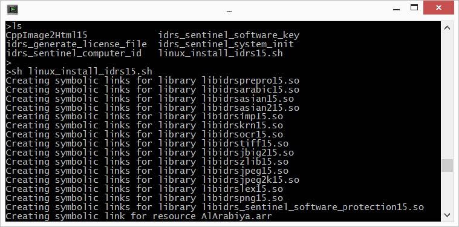
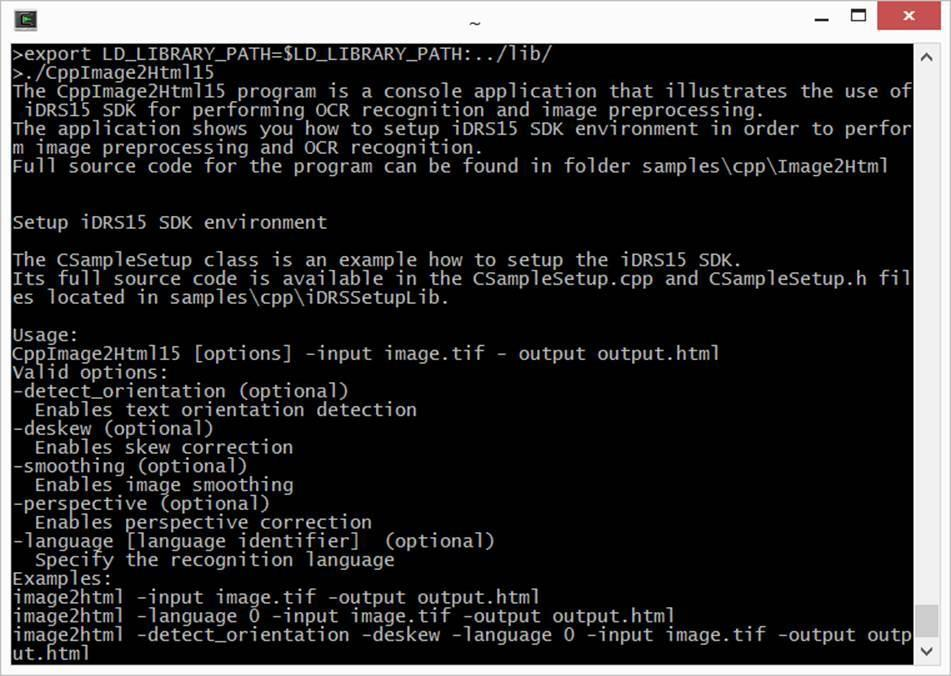

## Platform-specific SDK packages

| Platform | Package Type | Action |
| --- | --- | --- |
| **Windows & Android** | .zip | 1. Download the SDK package.  2. Extract the .zip file to a local drive. |
| **Linux** | .tar.bz2 | 1. Download the SDK package.  2. Extract the tarball to a local folder using tar -xvjf filename.tar.bz2. |
| **macOS & iOS** | .dmg | 1. Download the SDK package.  2. Mount the .dmg file.  3. Copy contents to a local drive. |
| **NuGet** | NuGet packages (.nupkg) | 1. Open your project in Visual Studio.  2. Add the required NuGet packages via Package Manager or dotnet add package. |

## Toolkit Content

The **IRISOCR™ SDK package** contains the following folders and subfolders:

| Folder | Windows | Linux | macOS | Android | iOS |
| --- | --- | --- | --- | --- | --- |
| **Welcome page**  (Documentation) | Gateway to documentation | | | | |
| **bin** | Samples and utility binaries | Samples and utility binaries | SDK framework + utilities + C wrapper (.dll and .xml) | Precompiled samples *(empty now)* | SDK framework |
| **include** | Header files | Header files |  | Header files |  |
| **include\_c** | C headers | C headers | C headers |  |  |
| **lib** | `.lib` file for DLL | `.so` files + idrs\_cs\_wrapper.dll and idrs\_cs\_wrapper.xml |  | `.so` files for all available ABIs |  |
| **redist** | Visual Studio redistributables (VS2022) |  |  |  |  |
| **resources** | All resources needed for characters recognition, such as lexicons and fonts dictionaries. | | | | |
| **samples** | C, C++, C# examples | C, C++, C# examples | C, C++, C# examples | SmartCapture | SmartCapture |
| **work** | Images for testing purposes | | | | |

:::tip
See the next tables per platform for a detailed description of all the binaries.
Also, refer to Files required for your application.
:::

## List of files that are contained in the **bin** subfolder

Windows

Table 1. Windows - bin subfolder

| File Type | File name | Description |
| --- | --- | --- |
| **Libraries** | idrsbarcode16.dll | Main Barcode engine |
|  | idrsbarcodeevoi.dll | Auxiliary barcode engine |
|  | idrsevoibarcodewrapper16.dll | Auxiliary barcode engine wrapper |
|  | idrsbarcodeext16.dll | QR code engine |
|  | idrsirisbarcodeextwrapper16.dll | QR code engine wrapper |
|  | idrsdocout16.dll | Document output library |
|  | idrsdmtxbarcodewrapper16.dll | Datamatrix barcode engine wrapper |
|  | idrsdmtx16.dll | Support for datamatrix barcodes |
|  | idrsirisbarcodewrapper16.dll | Barcode engine wrapper |
|  | idrskrn16.dll | iDRS™ main library |
|  | idrsnetframework16.dll | .NET Framework API assembly |
|  | idrsnetframework16.xml | .NET Framework API documentation |
|  | idrsocr16.dll | OCR/ICR kernel |
|  | idrsimp16.dll | Camera image preprocessing library |
|  | idrsprepro16.dll | Image preprocessing library |
|  | idrstiff16.dll | Tiff library |
|  | idrszlib16.dll | Zlib library |
|  | idrsjpeg2k16.dll | Wavelet compression library |
|  | idrsjbig216.dll | Symbol compression library |
|  | idrsjpeg16.dll | Jpeg encoding library |
|  | idrspng16.dll | PNG encoding library |
|  | idrsasian216.dll | Asian OCR engine |
|  | idrsc16.dll | C API runtime |
|  | idrsnet16.dll | .NET API assembly |
|  | idrsnet16.xml | .NET API documentation |
| **Sample Applications** | CppBarcode16.exe | This sample application demonstrates the barcode recognition features. This sample is built using the C++ API. The source code can be found in **&lt;IDRS\_SDK\_ROOT&gt;/samples/cpp/Barcode**. |
|  | CppImage2Html16.exe | This sample application shows how to convert an image to html text. This sample is built using the C++ API. The source code can be found in **&lt;IDRS\_SDK\_ROOT&gt;/samples/cpp/Image2Html** |
|  | CImage2Html16.exe | This sample application shows how to convert an image to html text. This sample is built using the C API. The source code can be found in **&lt;IDRS\_SDK\_ROOT&gt;samples/c/Image2Html** |
|  | CppReader16.exe | This sample application demonstrates the character recognition and the document output features. This sample is built using the C++ API. The source code can be found in **&lt;IDRS\_SDK\_ROOT&gt;/samples/cpp/Reader** |
|  | CsBarcode16.exe | This sample application demonstrates the barcode recognition features. This sample is built using the .NET API. The source code can be found in **&lt;IDRS\_SDK\_ROOT&gt;/samples/dotnet/Barcode** |
|  | CsImage2Html16.exe | This sample application shows how to convert an image to html text. his sample is built using the .NET API. The source code can be found in **&lt;IDRS\_SDK\_ROOT&gt;/samples/dotnet/Image2Html** |
|  | CsReader16.exe | This sample application demonstrates the character recognition and the document output features. This sample is built using the .NET API. The source code can be found in **&lt;IDRS\_SDK\_ROOT&gt;/samples/dotnet/Reader** |

macOS

Table 2. macOS - bin subfolder

| File Type | File name | Description |
| --- | --- | --- |
| **bin/Framework** | iDRS16.framework | iDRS™ framework |
| **bin** | libidrsc16.dylib | C API runtime |
|  | idrsnet16.dll | .NET API assembly |
|  | idrsnet16.xml | .NET API assembly documentation |
| **Sample Applications** | CppBarcode16 | This sample application demonstrates the barcode recognition features. This sample is built using the C++ API. The source code can be found in **&lt;IDRS\_SDK\_ROOT&gt;/samples/cpp/Barcode**. |
|  | CppImage2Html16 | This sample application shows how to convert an image to html text. This sample is built using the C++ API. The source code can be found in **&lt;IDRS\_SDK\_ROOT&gt;/samples/cpp/Image2Html** |
|  | CppReader16 | This sample application demonstrates the character recognition and the document output features. This sample is built using the C++ API. The source code can be found in **&lt;IDRS\_SDK\_ROOT&gt;/samples/cpp/Reader** |
|  | CImage2Html16 | This sample application shows how to convert an image to html text. This sample is built using the C API. The source code can be found in **&lt;IDRS\_SDK\_ROOT&gt;samples/c/Image2Html** |
|  | CsBarcode16 | This sample application demonstrates the iDRS™ barcode recognition features. This sample is built using the .NET API. The source code can be found in **&lt;IDRS\_SDK\_ROOT&gt;/samples/dotnet/Barcode** |
|  | CsImage2Html16 | This sample application shows how to convert an image to html text. his sample is built using the .NET API. The source code can be found in **&lt;IDRS\_SDK\_ROOT&gt;/samples/dotnet/Image2Html** |
|  | CsReader16 | This sample application demonstrates the character recognition and the document output features. This sample is built using the .NET API. The source code can be found in **&lt;IDRS\_SDK\_ROOT&gt;/samples/dotnet/Reader** |

Linux

Table 3. Linux - bin subfolder

| File Type | File name | Description |
| --- | --- | --- |
| **Utility Programs** | linux\_install\_idrs.sh | Shell script used to create symbolic links for the files needed by the SDK. |
| **Sample Applications** | CppBarcode16 | This sample application demonstrates the barcode recognition features. This sample is built using the C++ API. The source code can be found in **&lt;IDRS\_SDK\_ROOT&gt;/samples/cpp/Barcode**. |
|  | CppImage2Html16 | This sample application shows how to convert an image to html text. This sample is built using the C++ API. The source code can be found in **&lt;IDRS\_SDK\_ROOT&gt;/samples/cpp/Image2Html** |
|  | CppReader16 | This sample application demonstrates the character recognition and the document output features. This sample is built using the C++ API. The source code can be found in **&lt;IDRS\_SDK\_ROOT&gt;/samples/cpp/Reader** |
|  | CImage2Html16 | This sample application shows how to convert an image to html text. This sample is built using the C API. The source code can be found in **&lt;IDRS\_SDK\_ROOT&gt;samples/c/Image2Html** |
|  | CsBarcode16 | This sample application demonstrates the barcode recognition features. This sample is built using the .NET API. The source code can be found in **&lt;IDRS\_SDK\_ROOT&gt;/samples/dotnet/Barcode** |
|  | CsImage2Html16 | This sample application shows how to convert an image to html text. his sample is built using the .NET API. The source code can be found in **&lt;IDRS\_SDK\_ROOT&gt;/samples/dotnet/Image2Html** |
|  | CsReader16 | This sample application demonstrates the character recognition and the document output features. This sample is built using the .NET API. The source code can be found in **&lt;IDRS\_SDK\_ROOT&gt;/samples/dotnet/Reader** |

In the **lib** subfolder, you can also find:

* libidrsc16.so.version: C API runtime
* idrsnet16.dll: .NET API assembly
* idrsnet16.xml: .NET API assembly documentation

**Environment setup**

You need to establish the correct environment before using the toolkit.

The distribution package contains the full versioned library names for which symbolic links need to be created in the correct place.  
The package contains a utility shell script that takes care of creating all the necessary symbolic links for you.

In order to invoke the shell script, follow these instructions:

|  |  |
| --- | --- |
| **1** | Open a **terminal window** and go to the path where you unpacked the tar.bz2 archive containing the package. |
| **2** | Go to the **bin** folder |
| **3** | Execute **sh linux\_install\_idrs.sh** |

Image 1. Execute linux\_install\_idrs.sh

After creating the necessary symbolic links, you need to set the **LD\_LIBRARY\_PATH** environment variable to point to the lib folder.

Run the following **command**:

`export LD_LIBRARY_PATH=$LD_LIBRARY_PATH:<path_to_iDRS_package>/lib/`

Image 2. Set LD\_LIBRARY\_PATH environment variable

:::tip
You can add the above command to your .bash\_profile not to repeat it each time you launch a new terminal window.
:::

You are now able to use the toolkit.  
You can launch the sample application **CppImage2Html16** to test that everything works fine.

Android

**Host setup**

To build Android applications using the IRISOCR™ SDK, make sure that the following elements are installed on the **host computer**:

1. **Android SDK**  
   The toolkit is compatible with Android 4.2.2 (API 17) or higher. At least one API must be installed.
2. **Android NDK**  
   As the IRISOCR™ SDK consists in native libraries, you need to have the Android NDK (Native Development Kit) available on your host computer.

   :::caution
   No path with spaces
   Known issue with the Android NDK: compilation may fail if the path to the installed NDK package contains spaces!
   :::
3. **Android Studio**  
   The official IDE for Android development is Android Studio. Of course, alternatives do exist and may be used instead.

Android Compatibility

* SDK version or target SDK version must be at least *Android API 17*.
* Android guidelines say native libraries of an Android application should link against shared C++ runtime, and all libraries should use the same runtime (see [https://developer.android.com/ndk/guides/cpp-support.html](https://developer.android.com/ndk/guides/cpp-support.html)) . The IRISOCR™ SDK follows that directive.

NuGet

* **Platform packages**: These packages automatically download all the packages needed for your operating system and architecture. These packages are:

  + **iDRS.macOS**
  + **iDRS.Windows**
* **Architecture packages**: These packages download the packages needed for your specific architecture. These packages are:

  + **iDRS.Windows-x86**
  + **iDRS.Windows-x64**
  + **iDRS.Linux-x64**
* **Low-level packages**: These packages are downloaded automatically when a platform and architecture package is used. But they can also be used directly if greater flexibility is required. These packages are:

  + **iDRS.assets**: This package contains the resources files needed to perform OCR.
  + **iDRS.NET**: This package contains the .NET dlls.
  + **iDRS.runtime-*platform-arch*** packages: A package containing the native library for each platform and architecture.