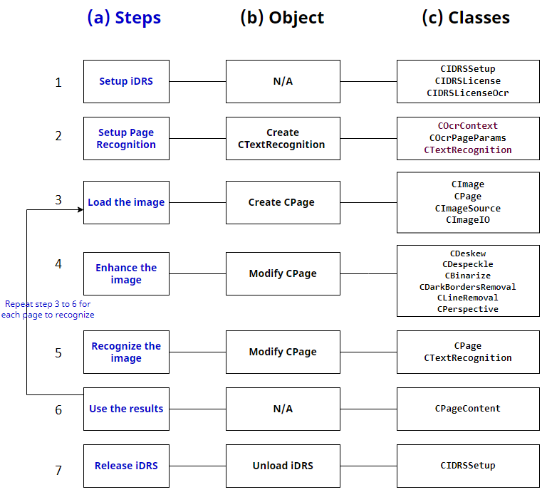
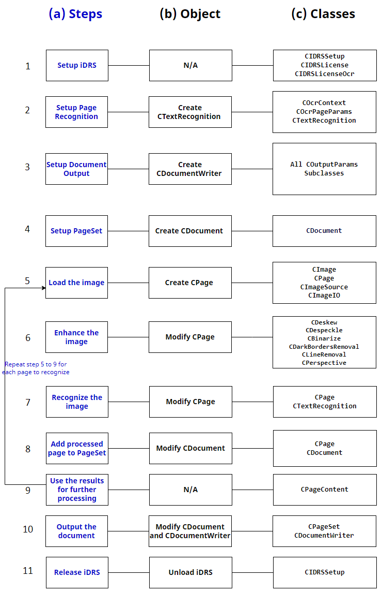
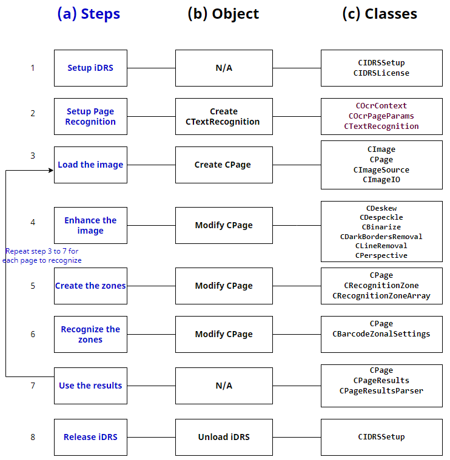

In this section, we provide a general overview of some **typical use cases** of the IRISOCR™ SDK.

A drawing for each use case describes:

**(a)** the *main steps* to be taken,  
**(b)** the *main object* to create or to modify in each step and  
**(c)** the *main classes* involved in the step.

:::note
NOTES
Pages are processed independently.
The step Enhance the image (Preprocessing), is optional and depends on the quality of your image. The IRISOCR™ SDK offers many image enhancement functionalities. The full list of these functionalities can be found in the API REF > Preprocessing / Advanced preprocessing.
:::

## Full page text recognition

Image 1. Steps in a full-page text recognition scenario

## Full page text recognition and formatting

Image 2. Steps in a full-page text recognition and formatting scenario

## Zonal text recognition

Image 3. Steps in a zonal text recognition scenario