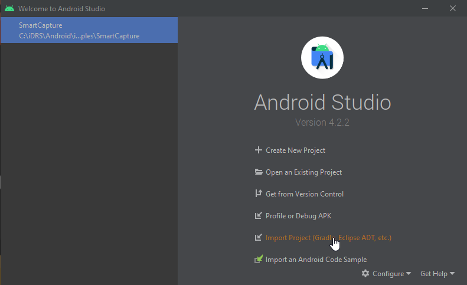
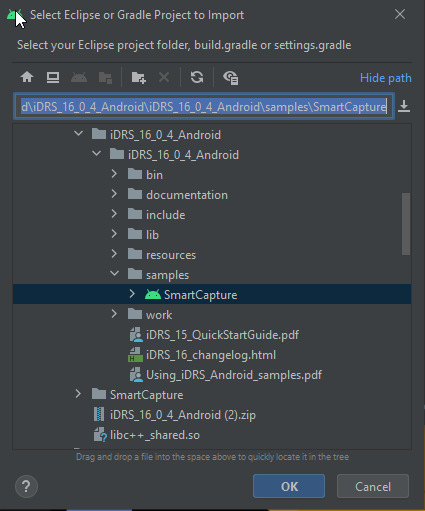
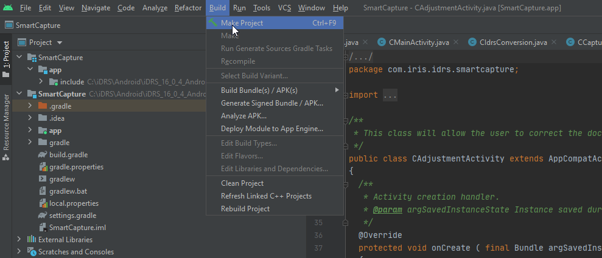
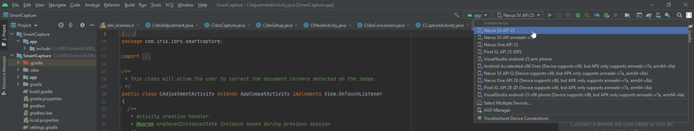
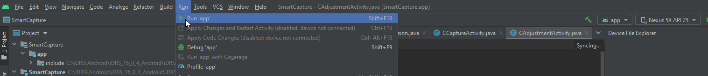

## Overview

This section describes how to build and deploy the samples on an Android device, and how to modify the licenses used by the samples, which are for the moment hardcoded in the application’s source code.

## Operating Systems

**Android**: armeabi-v7a, arm64-v8a, x86, x86\_64

## Prerequisites

### Host setup

To build Android applications using the IRISOCR™ SDK, make sure that the following elements are installed on the host computer:

* **Android SDK**

  + Our SDK is compatible with Android 4.2.2 (API 17) or higher. At least one API with level equal or higher than 17 must be installed.
  + However, the **SmartCapture** sample application uses the Android camera2 interface, therefore requires at least **API level 23** (Android 6.0). This is a prerequisite of the sample itself, not of the iDRS™ SDK.
* **Android NDK**

  + As the iDRS™ consists in native libraries, you need to have the Android NDK (Native Development Kit) available on your host computer.  
    Just for information, the iDRS™ libraries are compiled using Android NDK revision 17c.
  + Command ndk-build must be accessible in the system PATH

    :::caution
    No path with spaces
    Known issue with the Android NDK: compilation may fail if the path to the installed NDK package contains spaces!
    :::
* **Android Studio**

  + The official IDE for Android development is Android Studio. Of course, alternatives do exist and may be used instead.

### Target device

The samples have been validated with the following devices:

* Samsung galaxy S10
* Samsung galaxy S8+

### Considerations for C++ library support

As detailed in Android guidelines (see [https://developer.android.com/ndk/guides/cpp-support.html](https://developer.android.com/ndk/guides/cpp-support.html)), native libraries of an Android application should link against shared C++ runtime, and all libraries of the application should use the same runtime.

The iDRS™ uses libc++ shared runtime (c++\_shared) as per Android recommendations, so your application should do the same.

## How to run a sample with Android Studio

### Import the project

The sample applications sources are located in the folder `<iDRS_toolkit>/samples/<sample_name>`, where `<iDRS_toolkit>` is the path to the toolkit root folder and `<sample_name>` the sample name (e.g. SmartCapture).

To load a project with Android Studio, use the **Import project** feature as below:



A dialog box opens. Select the desired project in the samples folder and click **OK**:



The sample application project opens.

:::note
Android Studio may ask to reload the project due to Language level changes. Answer Yes to perform the reload.
After that, the project is loaded and ready to use.
:::

### Build the application

To build the application, go to menu **Build** and select **Make Project** (or **Rebuild Project** in order to rebuild everything):



### Start the application from Android Studio

To launch the application from Android Studio, select a running device from the drop down list:



Then simply hit **Run 'app'** from the **Run** menu.



The application is then launched on the selected device or emulator.

:::note
Devices must be set in developer mode and allow USB debugging, in order to be selectable by Android Studio (see http://developer.android.com/tools/device.html for more details).
:::

## Notes on the sample applications

### Resources verification at startup

The SDK uses several external resource files when performing character recognition. These files are embedded in the sample’s APK file as assets, which mean that they are not extracted by the Android system when it installs the sample application.

Therefore, when a sample application is started, it checks first if the resources are available on the device at the location pointed by `Context.getExternalFilesDir("resources")`.

If the resources files are not present at that path, the sample automatically extracts them from its assets and copies them at that location, so that the SDK can access them easily later on. If the resources files are already present, no operation is performed and the sample continues its execution.  
Be aware that this operation can take up to several seconds.

Of course, this is not the recommended way to ship the resources with your application: Google store has a maximum size limit of 50 mo for an .apk file, and with the resources embedded the sample apks are over that threshold.

The reason why all resources are included in the sample APK is to allow "1-click deployment" of the samples, so that you can easily get started with iDRS testing.

For more information on how to properly manage resources in an Android application, refer to the Android online documentation at [http://developer.android.com/google/play/expansion-files.html](http://developer.android.com/google/play/expansion-files.html).

### Modifying the hardcoded licenses

The licenses are hardcoded in the native header of the source files:

* **SmartCapture**: `SmartCapture/app/src/main/jni/idrs_licenses.h`

```
#define IDRS_LICENSE_IMAGE_FILE "IDRS_TRIAL_IMAGE_FILE_IRIS_*****"

#define IDRS_LICENSE_PREPRO "IDRS_TRIAL_PREPRO_IRIS_*****"

#define IDRS_LICENSE_OCR "IDRS_TRIAL_OCR_IRIS_*****"
```

To update the licenses, simply modify the define values with the new licenses; then rebuild the application to update it.

### Recognition languages selection

The languages available for recognition in the samples are hardcoded in their source code. Please note that this limitation does *not* apply to the iDRS™ toolkit: at the moment, the toolkit is able to recognize all the languages available on desktop masters.

The **Language enum** exposes all the available languages for the toolkit, and is defined in the iDRS header file `<iDRS_toolkit>/include/Language.h`:

```
enum Language
{
  /**
  * \brief English (American)
  */
  English = 0,
  /**
  * \brief German
  */
  German = 1,
  /**
  * \brief French
  */
  French = 2,
  /**
  * \brief Spanish
  */
  Spanish = 3,
  […]
```

### SmartCapture

In the SmartCapture sample, a selection screen allows you to modify the recognition language; for the sake of simplifying the layout, only a subset of languages is exposed to the application user:

* English
* French
* German
* Spanish
* Italian
* Dutch
* Japanese
* Simplified Chinese
* Traditional Chinese
* Korean

This set can be modified the following way:

1. Edit the pop-up menu displaying the list of languages defined in `&lt;SmartCapture&gt;/app/src/main/res/layout/popup_ocr_language.xml` to add or remove languages as you wish:

   ```
   &lt;RadioGroup
     android:layout_width="wrap_content"
     android:layout_height="wrap_content"
     android:orientation="vertical"&gt;
     &lt;RadioButton
       [...]
       android:id="@+id/English"
       android:text="English"
       android:tag="0"/&gt;
     &lt;RadioButton
       [...]
       android:id="@+id/German"
       android:text="German"
       android:tag="1"/&gt;
     &lt;RadioButton
       [...]
       android:id="@+id/French"
       android:text="French"
       android:tag="2"/&gt;
     [...]
   </RadioGroup>

   The "tag" value is provided to the iDRS™ directly as an IDRS_LANGUAGE enum value, thus it needs to correspond (0 for English, 1 for German, etc.)
   ```
2. Recompile and redeploy the application.

## Image capture feature

The sample application **SmartCapture** is a complete application that can convert images taken from the camera or from the gallery to a wide range of document formats, including PDF and DOCX.

The application workflow is split in several distinct steps, so that you can understand easily the various use cases the iDRS™ technology can address.

One of the most interesting feature illustrated is the **image capture step**: the sample application can automatically select the best frame from the video stream of the device’s camera by using the hardware status information and the iDRS™ mobile capture technology.

The following elements are monitored:

* **Document exposure**: does the scene receive enough light?
* **Camera focus**: is the camera lens focused?
* **Device stability**: isn’t the device shaking?
* **Document corners**: have the corners of the document been detected?
* **Size of target area (document)**: is the document large enough compared to the picture size?
* **OCR quality**: is the document’s quality for running OCR good enough?


In the **SmartCapture** sample application, those information are displayed on the capture view. However, you may want to remove some or all of the indicators for your own application…​