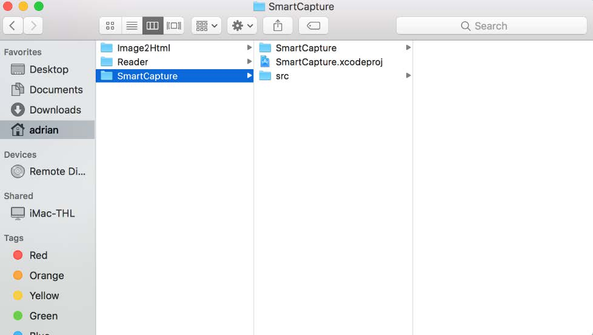
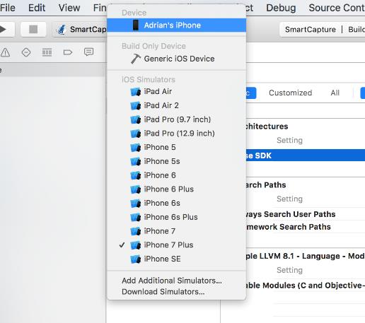
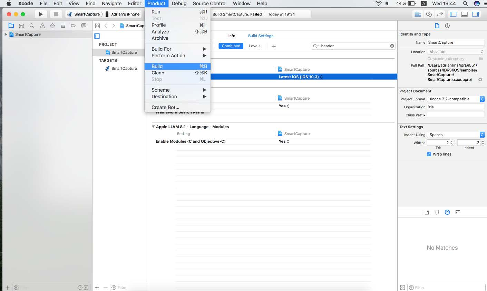
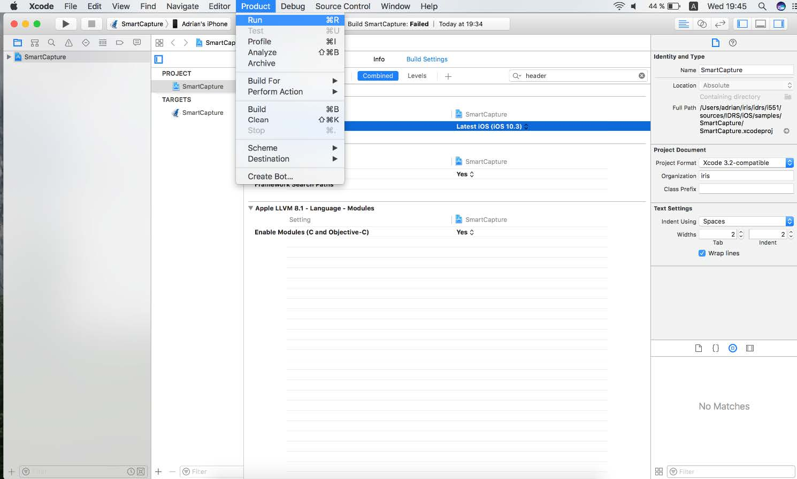
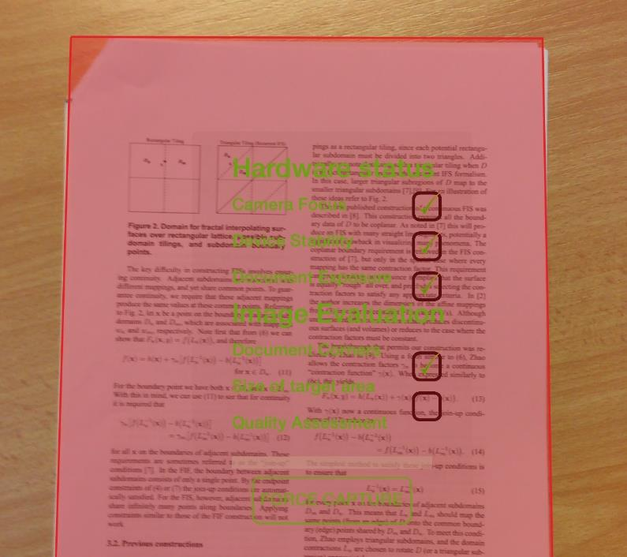

## Overview

This section describes how to build and deploy the samples on an iOS device, and how to modify the licenses used by the samples, which are for the moment hardcoded in the application’s source code.

### Supported Architectures

The toolkit for **iOS** supports the following architectures: **x86\_64, arm64**

### Prerequisites

#### Host setup

To be able to build the sample applications, the host computer must have **Xcode Application** installed:

However, the **SmartCapture** sample application requires Xcode 8 or later, as it is built using Swift 5.

:::note
The SDK for iOS is not dependent on any Swift version; it is a prerequisite of the sample itself, not of the SDK.
:::

#### Target device

The SDK is compatible with devices running iOS 10.3 or later.

The samples have been validated against the following devices:

* iPhone Xr
* Xcode simulator

#### C++ standard library

The SDK is linked against the **libc++ standard library** (LLVM C++ standard library) and not against the libstdc++ (GNU C++ standard library), the latter being considered deprecated.  
You application *has to* do the same to avoid conflicts when linking against the framework.

### How to run a sample with Xcode

#### Open the project

The sample applications sources are located in the folder `<iDRS_toolkit>/samples/<sample_name>`, where `<iDRS_toolkit>` is the path to the iDRS toolkit root folder and `<sample_name>` the sample name (e.g. SmartCapture)

To load a project within Xcode, use **Finder** to browse to the sample’s source folder, then double-click on the project file (.xcodeproj extension).



#### Select the target device

To compile and run the sample application on a real device, you need to have the device plugged to the computer, and a developer profile available (go to [https://developer.apple.com/library/ios/documentation/IDEs/Conceptual/AppDistributionGuide/MaintainingCertificates/MaintainingCertificates.html](https://developer.apple.com/library/ios/documentation/IDEs/Conceptual/AppDistributionGuide/MaintainingCertificates/MaintainingCertificates.html) for more information about profiles).

Then, you can select the device from the XCode interface.



#### Build the application

To build the application, go to menu **Product** and select **Build**.



#### Start the application from Xcode

Now you can start the application from XCode: simply hit **Run** from the **Product** menu.



The application is launched on the selected device or simulator.

### Notes on sample applications

#### Modifying the hardcoded licenses

The licenses are hardcoded in the native header of the source files:

* **SmartCapture**: `SmartCapture/src/idrs_licenses.h`

```
#define IDRS_LICENSE_IMAGE_FILE "IDRS_TRIAL_IMAGE_FILE_IRIS_*****"

#define IDRS_LICENSE_PREPRO "IDRS_TRIAL_PREPRO_IRIS_*****"

#define IDRS_LICENSE_OCR "IDRS_TRIAL_OCR_IRIS_*****"
```

To update the licenses, simply modify the define values with the new licenses; then rebuild the application to update it.

#### Recognition languages selection

The languages available for recognition in the samples are hardcoded in their source code. Note that this limitation does *not* apply to the toolkit: at the moment, the toolkit is able to recognize all the languages available on desktop masters.

The **Language enum** exposes all the available languages for the toolkit, and is defined in the header file `<iDRS_toolkit>/include/Language.h`:

```
enum Language
{
  /**
  * \brief English (American)
  */
  English = 0,
  /**
  * \brief German
  */
  German = 1,
  /**
  * \brief French
  */
  French = 2,
  /**
  * \brief Spanish
  */
  Spanish = 3,
  […]
```

#### SmartCapture

In the SmartCapture sample, a selection screen allows you to modify the recognition language; for the sake of simplifying the layout, only a subset of languages is exposed to the application user:

* English
* French
* German
* Spanish
* Italian
* Dutch
* Japanese
* Simplified Chinese
* Traditional Chinese
* Korean

### Image capture feature

The sample application **SmartCapture** is a complete application that can convert images taken from the camera or from the gallery to a wide range of document formats, including PDF and DOCX.

The application workflow is split in several distinct steps, so that you can understand easily the various use cases the iDRS™ technology can address.

One of the most interesting feature illustrated is the **image capture step**: the sample application can automatically select the best frame from the video stream of the device’s camera by using the hardware status information and the iDRS™ mobile capture technology.

The following elements are monitored:

* **Document exposure**: does the scene receive enough light?
* **Camera focus**: is the camera lens focused?
* **Device stability**: isn’t the device shaking?
* **Document corners**: have the corners of the document been detected?
* **Size of target area (document)**: is the document large enough compared to the picture size?
* **OCR quality**: is the document’s quality for running OCR good enough?



In the **SmartCapture** sample application, those information are displayed on the capture view. However, you may want to remove some or all of the indicators for your own application…​